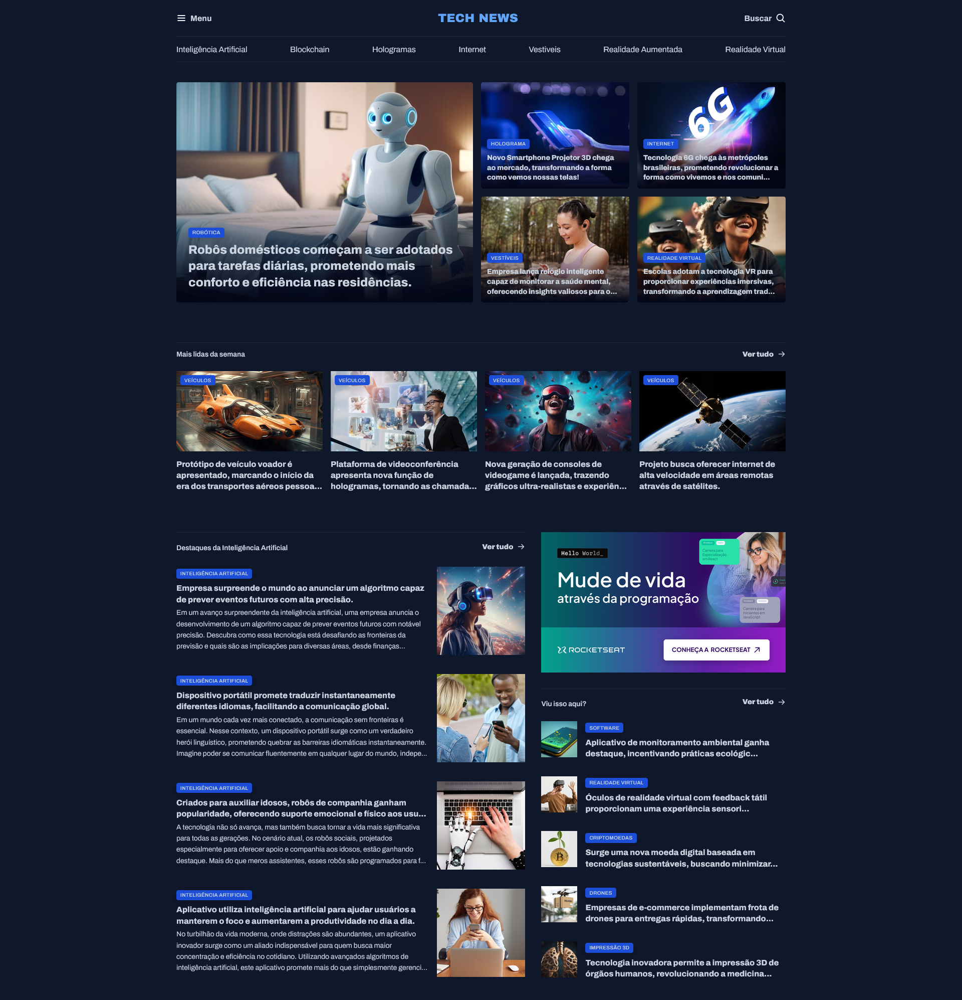

# Portal de Notícias

Layout de um portal de notícias desenvolvido durante o curso Full Stack da Rocketseat, com foco em HTML semântico e CSS.



## 🔗 Demo

[higorgsantana.github.io/portal-de-noticias](https://higorgsantana.github.io/portal-de-noticias/)

## 🛠️ Tecnologias

- HTML5
- CSS3

## 💡 Sobre

Projeto criado para praticar estruturação semântica de páginas e estilização com CSS puro, como parte dos estudos da trilha Full Stack da Rocketseat. O layout foi construído majoritariamente com **CSS Grid**, trabalhando organização de seções, alinhamento de conteúdo e responsividade.

## ⚙️ Como rodar

Clone o repositório e abra o arquivo `index.html` diretamente no navegador:

```bash
git clone https://github.com/higorgsantana/portal-de-noticias.git
```

Ou acesse a versão publicada direto pela demo acima.
